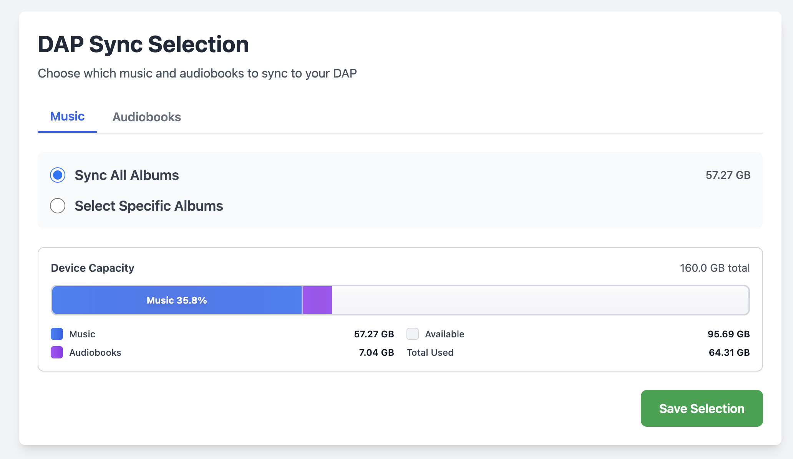

# DAP Sync Selection UI

A lightweight Ruby/Sinatra web UI for selecting which music and audiobooks to sync to your DAP (Digital Audio Player).



## Features

- Web interface to browse and select albums from your music library
- Option to sync all albums or select specific ones
- Selection is saved to a file that the sync script reads
- Dockerized for easy deployment
- Built with Ruby and Sinatra

## Setup

1. **Build and start the Docker container:**

```bash
docker-compose up -d
```

2. **Access the web UI:**

Open your browser to `http://localhost:3000`

3. **Select albums:**

- Choose "Sync All Albums" to sync everything (default behavior)
- Or choose "Select Specific Albums" and check the albums you want to sync
- Click "Save Selection" to save your choices

## How It Works

- The UI scans the music and audiobooks directories for content
- Your selection is saved to `./data/sync_selection.txt` in a simple **key=value format** (no Python/JSON required)
- The `dap_sync.sh` script reads this file using pure bash:
  - Format: `MUSIC_ALBUM=/full/path` (one per line), `AUDIOBOOKS=/full/path` (one per line)
  - If no `MUSIC_ALBUM=` lines exist → syncs all albums
  - If `MUSIC_ALBUM=` lines exist → syncs only the listed albums
  - Same logic applies to `AUDIOBOOKS=` lines
  - When "Sync All" is selected in the UI, **all albums/audiobooks are explicitly listed** in the file
- Full paths are hardcoded in the script (no environment variables needed)

## Configuration

Paths are configurable via environment variables (set in `docker-compose.yml`):

- `MUSIC_SOURCE` - source music directory inside container (default: `/music/`)
- `AUDIOBOOKS_SOURCE` - source audiobooks directory inside container (default: `/audiobooks/`)
- `MUSIC_DIRECTORY` - **full host path** for music (used in sync_selection.txt)
- `AUDIOBOOKS_DIRECTORY` - **full host path** for audiobooks (used in sync_selection.txt)
- `SYNC_SELECTION_FILE` - where to save selection (default: `/data/sync_selection.txt`)
- `DEVICE_SIZE` - device capacity in GB (default: `160`)

The Docker volume mounts ensure:
- Music source is mounted read-only from host to container
- Audiobooks source is mounted read-only from host to container
- Selection file is persisted in `./data/` directory on the host

**Important:** The `sync_selection.txt` file stores **full absolute paths** using `MUSIC_DIRECTORY` and `AUDIOBOOKS_DIRECTORY`, allowing the sync script to work with paths directly.

## Usage with Sync Script

The sync script (`dap_sync.sh`) will automatically read the selection file. Make sure the path to `sync_selection.txt` is accessible from where you run the script.

If running the sync script from a different location, set the environment variable:

```bash
export SYNC_SELECTION_FILE=/path/to/data/sync_selection.txt
./dap_sync.sh
```

Or modify the default path in the script.

## Development

To run locally without Docker:

**Backend (Ruby/Sinatra):**
```bash
bundle install
bundle exec ruby app.rb
```

**Frontend (React):**
```bash
npm install
npm run dev
```

The frontend dev server will run on `http://localhost:5173` and proxy API requests to the backend on port 3000.

**Build for production:**
```bash
npm run build
```

This builds the React app into the `public/` directory, which Sinatra serves.

## Stopping the Server

```bash
docker-compose down
```
